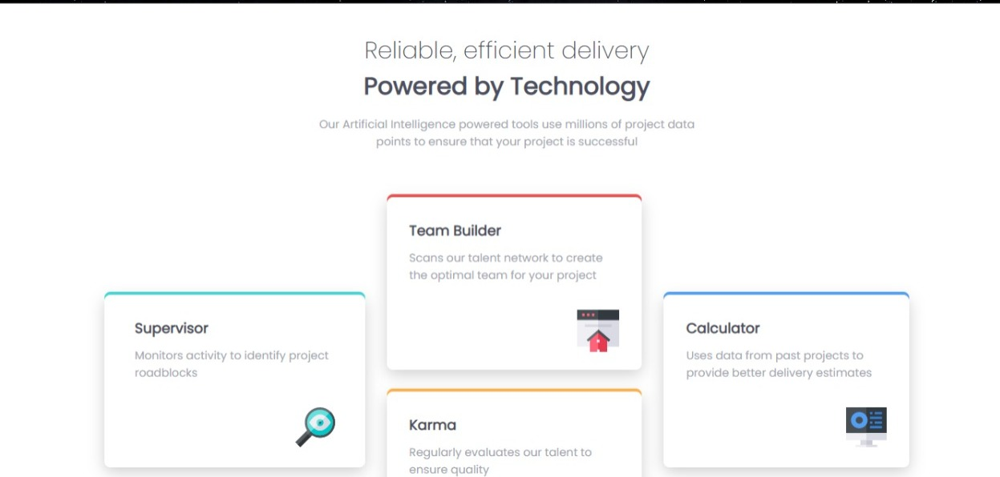

# Frontend Mentor - Four card feature section solution

This is a solution to the [Four card feature section challenge on Frontend Mentor](https://www.frontendmentor.io/challenges/four-card-feature-section-weK1eFYK). Frontend Mentor challenges help you improve your coding skills by building realistic projects. 

## Table of contents

## Overview

### The challenge

Users should be able to:

- View the optimal layout for the site depending on their device's screen size

### Screenshot

### Links

- Solution URL: [https://github.com/bosirullah/four-card-feature-section](https://your-solution-url.com)
- Live Site URL: [https://bosirullah.github.io/four-card-feature-section/](https://your-live-site-url.com)

## My process

### Built with

- Semantic HTML5 markup
- CSS custom properties
- Flexbox
- Mobile-first workflow

### What I learned

In this section I have learnt further about flexbox , how to use box shadow  , reverse the shadow position and font
size reponsiveness.

## Author

- Website - [https://github.com/bosirullah/four-card-feature-section](https://www.your-site.com)
- Frontend Mentor - [https://www.frontendmentor.io/profile/bosirullah](https://www.frontendmentor.io/profile/yourusername)
